# LAB 8 – Consommation d'un Web Service PHP avec Volley

## Aperçu du laboratoire

Ce laboratoire a pour objectif de développer une application Android complète communiquant avec un web service PHP via la bibliothèque Volley. L'application permet d'ajouter des étudiants et de visualiser la liste via des appels réseau asynchrones.

## Architecture du projet

Le laboratoire est divisé en trois parties distinctes :
1. **Partie 1** : Configuration du serveur et création de la base de données
2. **Partie 2** : Développement du web service PHP
3. **Partie 3** : Développement de l'application Android

---

## Partie 1 — Configuration du serveur et base de données

### Objectifs
- Mettre en place un environnement de développement local avec MAMP
- Créer une base de données MySQL
- Structurer la table des étudiants

### Étapes réalisées

#### 1. Installation et configuration de MAMP
MAMP (Mac, Apache, MySQL, PHP) a été installé pour servir d'environnement de développement local. Le serveur Apache a été configuré pour utiliser le dossier `htdocs` comme racine des projets PHP.

| Configuration MAMP |
|:------------------:|
| 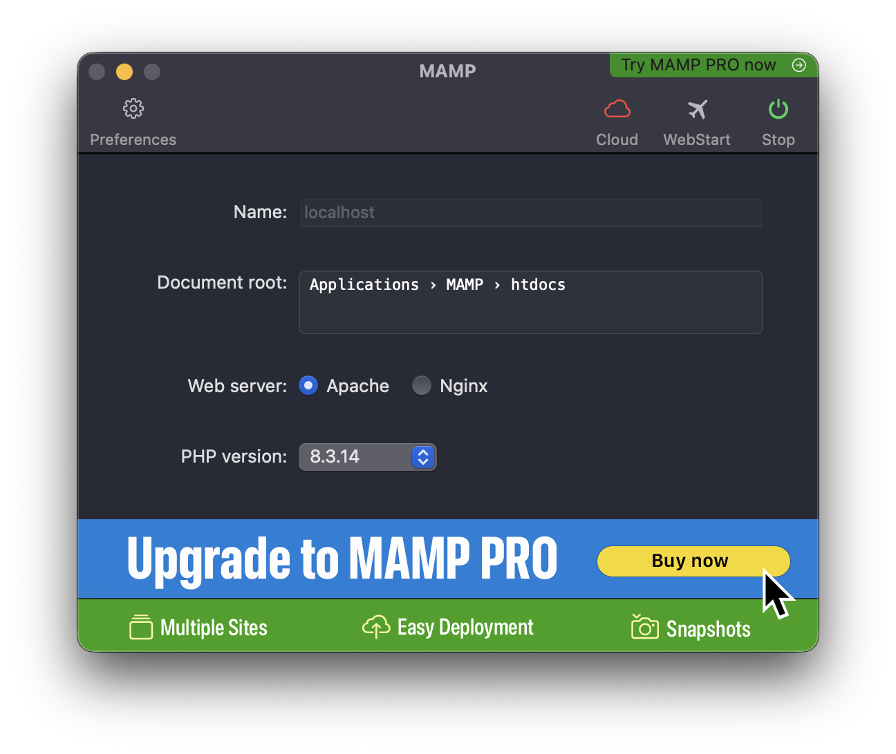 |

#### 2. Création de la base de données
Une base de données nommée `school1` a été créée via phpMyAdmin pour stocker les informations des étudiants.

#### 3. Création de la table `Etudiant`
La table contient les champs suivants :
- `id` : identifiant unique auto-incrémenté
- `nom` : nom de l'étudiant
- `prenom` : prénom de l'étudiant
- `ville` : ville de résidence
- `sexe` : genre de l'étudiant

```sql
CREATE TABLE Etudiant (
    id INT AUTO_INCREMENT PRIMARY KEY,
    nom VARCHAR(50),
    prenom VARCHAR(50),
    ville VARCHAR(50),
    sexe VARCHAR(10)
);
```

#### 4. Insertion des données initiales
Des enregistrements tests ont été ajoutés pour valider le fonctionnement de la base.

| Structure et données de la table |
|:-------------------------------:|
| 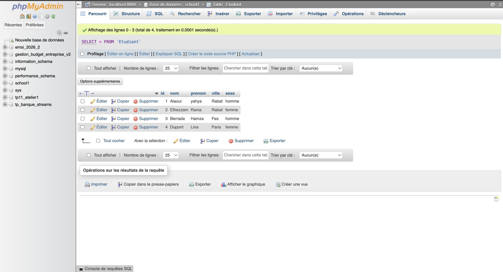 |

---

## Partie 2 — Développement du web service PHP

### Objectifs
- Créer une architecture PHP structurée (MVC simplifié)
- Développer des endpoints RESTful pour la gestion des étudiants
- Tester les web services avec Advanced REST Client

### Architecture du projet PHP

```
lab8_dev/
├── classes/
│   └── Etudiant.php          (modèle de données)
├── connexion/
│   └── Connexion.php         (gestion de la connexion PDO)
├── dao/
│   └── IDao.php              (interface générique CRUD)
├── service/
│   └── EtudiantService.php   (implémentation des méthodes)
└── ws/
    ├── createEtudiant.php    (endpoint POST pour ajouter)
    └── loadEtudiant.php      (endpoint GET pour lister)
```

### Endpoints développés

#### 1. `createEtudiant.php` (POST)
Reçoit les données d'un nouvel étudiant, les insère en base et retourne la liste mise à jour au format JSON.

#### 2. `loadEtudiant.php` (GET)
Retourne la liste complète des étudiants au format JSON.

### Tests des web services

Les web services ont été testés avec **Advanced REST Client** (extension Chrome) avant l'intégration Android.

#### Test de l'ajout d'un étudiant
Requête POST envoyée avec les paramètres :
- `nom` = Dupont
- `prenom` = Lina
- `ville` = Paris
- `sexe` = femme

| Test d'ajout (POST) | Réponse du serveur |
|:-------------------:|:-------------------:|
| 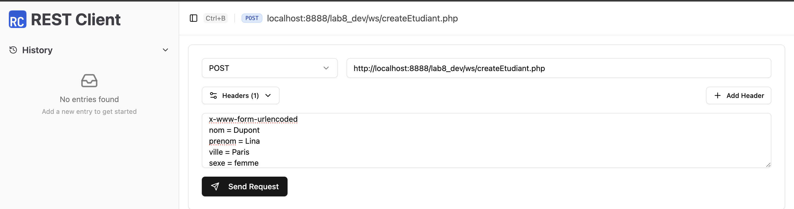 | 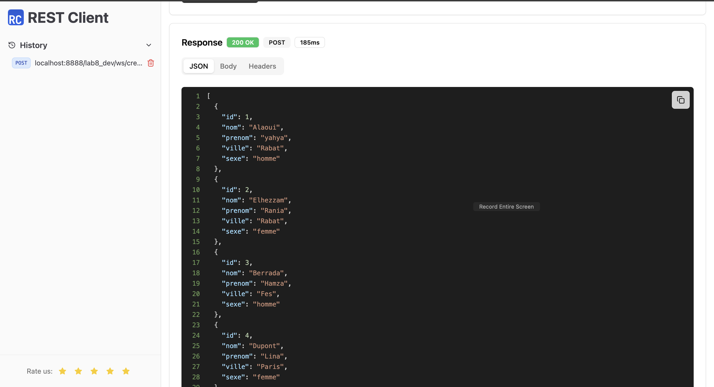 |

#### Test de chargement de la liste
Requête GET pour récupérer tous les étudiants.

| Test de chargement (GET) | Réponse JSON |
|:------------------------:|:-------------:|
| 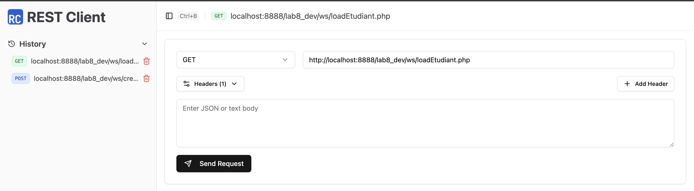 | 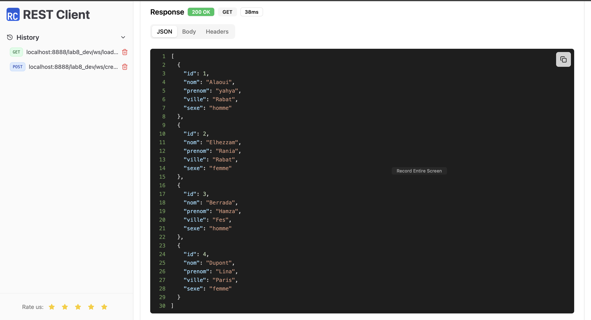 |

### Validation des données en base
Après les tests, la base de données a été vérifiée pour confirmer l'insertion correcte des enregistrements.

| État final de la table |
|:----------------------:|
| 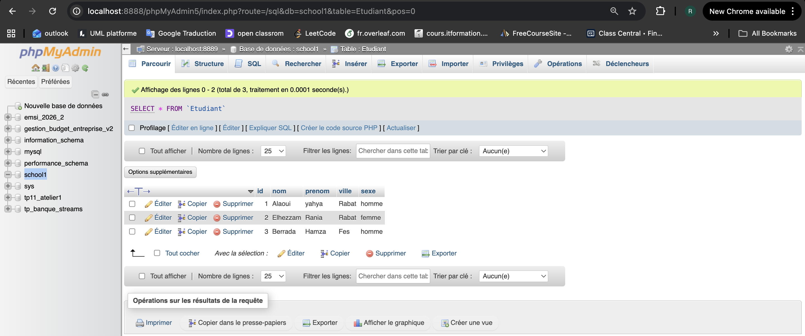 |

---

## Partie 3 — Application Android (Volley + Gson)

### Objectifs
- Créer une application Android communiquant avec le web service
- Utiliser Volley pour les requêtes réseau
- Utiliser Gson pour le parsing JSON
- Gérer la configuration réseau pour Android 9+

### Configuration du projet

#### Structure du projet Android

```
app/
├── src/main/
│   ├── java/com.example.lab8_deve/
│   │   ├── beans/
│   │   │   └── Etudiant.java          (modèle de données)
│   │   └── AddEtudiant.java            (activité principale)
│   ├── res/
│   │   ├── layout/
│   │   │   └── activity_add_etudiant.xml
│   │   ├── values/
│   │   │   └── strings.xml
│   │   └── xml/
│   │       └── network_security_config.xml
│   └── AndroidManifest.xml
```

#### Dépendances utilisées
- **Volley** : `com.android.volley:volley:1.2.1` (requêtes réseau)
- **Gson** : `com.google.code.gson:gson:2.10.1` (parsing JSON)

#### Configuration réseau (Android 9+)
Un fichier de configuration réseau a été créé pour autoriser le trafic HTTP en clair (nécessaire pour les tests en local).

```xml
<network-security-config>
    <domain-config cleartextTrafficPermitted="true">
        <domain includeSubdomains="true">10.0.2.2</domain>
    </domain-config>
</network-security-config>
```

### Interface utilisateur

L'application propose un formulaire simple avec :
- Champ **Nom**
- Champ **Prénom**
- Spinner **Ville** (liste déroulante)
- RadioGroup **Sexe** (Homme/Femme)
- Bouton **Ajouter**

| Interface de l'application |
|:--------------------------:|
| 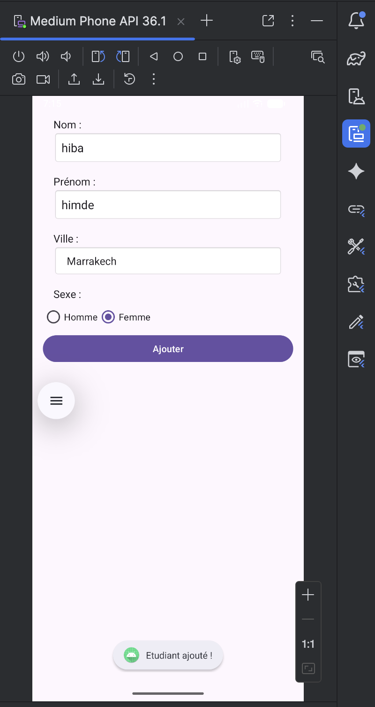 |

### Fonctionnement de l'application

#### 1. Envoi des données
Lorsque l'utilisateur clique sur "Ajouter", une requête POST est envoyée au web service avec les données du formulaire. La bibliothèque Volley gère l'appel asynchrone.

#### 2. Traitement de la réponse
La réponse JSON reçue est parsée avec Gson pour être convertie en objets Java. La liste mise à jour est affichée dans les logs (Logcat).

#### 3. Retour visuel
Un Toast confirme le succès de l'opération et le formulaire est automatiquement réinitialisé.

### Tests et validation

#### Test d'ajout d'un étudiant
L'application a été testée avec l'étudiant : Hiba Himde, ville Marrakech, sexe Féminin.

| Ajout dans l'application |
|:------------------------:|
|  |

#### Vérification en base de données
Après l'ajout, la base de données a été consultée pour confirmer la présence du nouvel enregistrement.

| Résultat dans phpMyAdmin |
|:------------------------:|
| 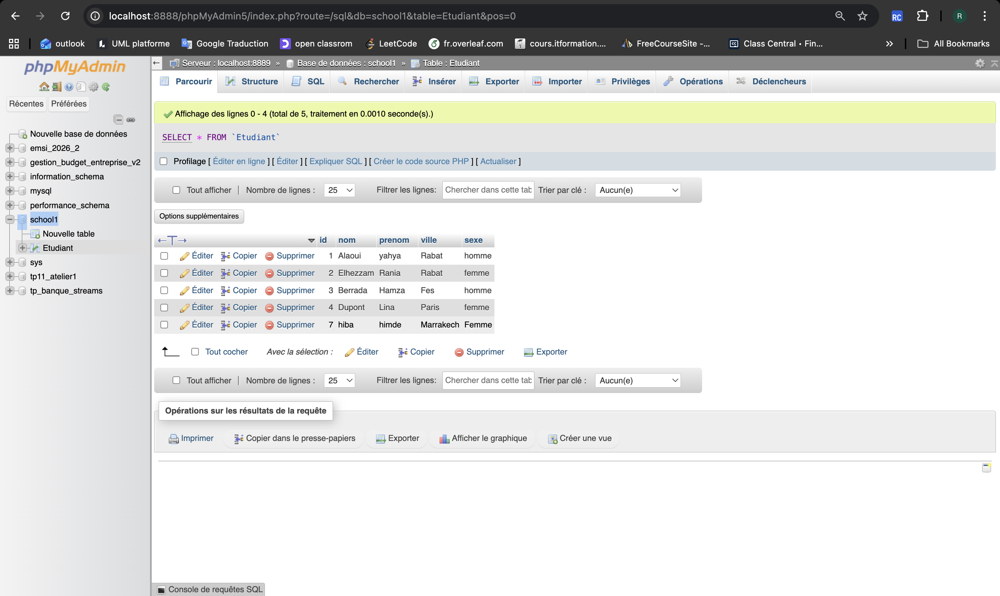 |

#### Analyse des logs (Logcat)
Les logs ont été analysés pour vérifier le bon fonctionnement des appels réseau et du parsing JSON.

| Logcat - Réponse serveur |
|:------------------------:|
| 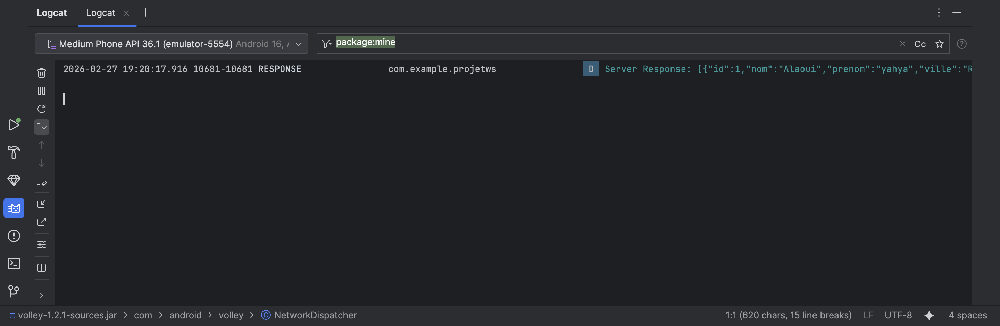 |

| Logcat - Parsing des données |
|:----------------------------:|
| 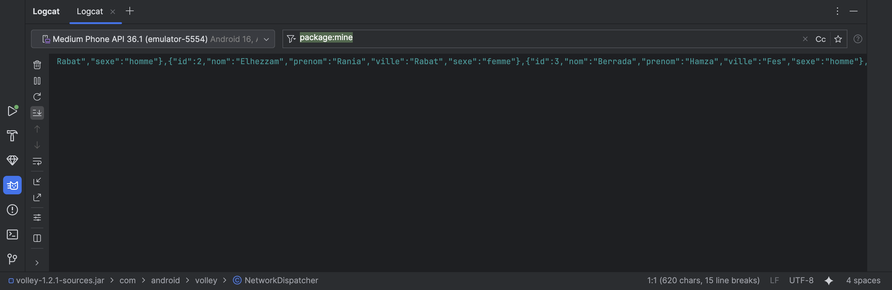 |

| Logcat - Détail des objets |
|:--------------------------:|
| 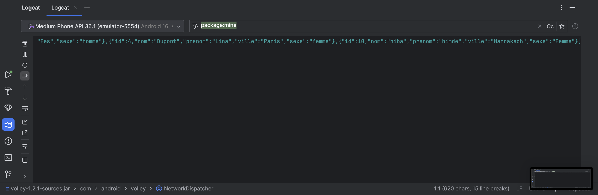 |

---

## Compétences acquises

À travers ce laboratoire, les compétences suivantes ont été développées :

1. **Développement web côté serveur**
   - Création d'une API RESTful avec PHP
   - Utilisation de PDO pour l'accès sécurisé à MySQL
   - Structuration d'un projet en couches (DAO, Service)

2. **Développement mobile Android**
   - Consommation de web services avec Volley
   - Parsing JSON avec Gson
   - Gestion des permissions et configuration réseau
   - Création d'interfaces utilisateur dynamiques

3. **Intégration et tests**
   - Test des API avec Advanced REST Client
   - Débogage avec Logcat
   - Validation des données en base

